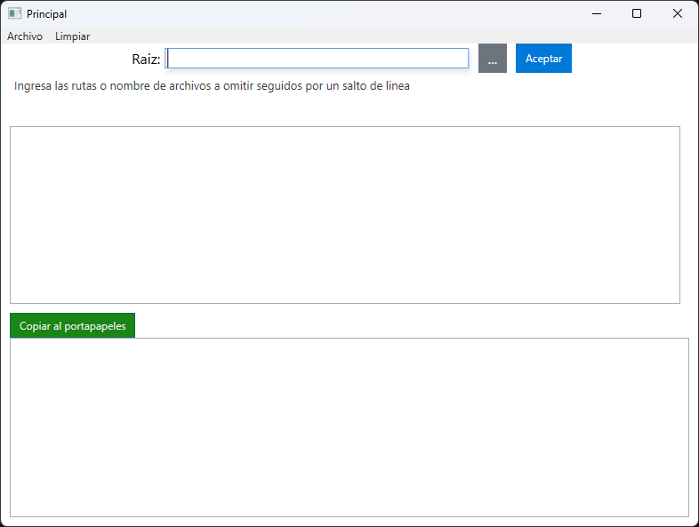
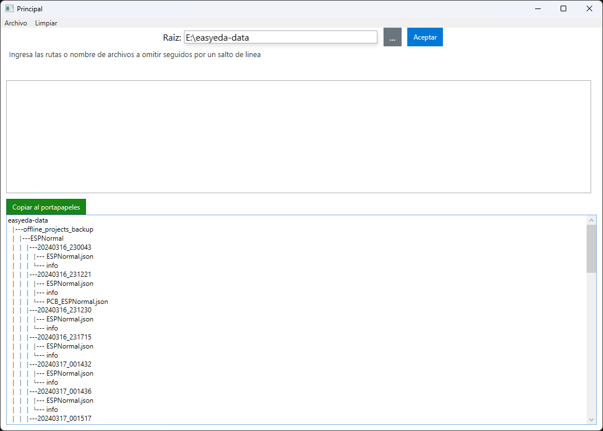

# FileTreeViewerWPF

## Descripción

FileTreeViewerWPF es una aplicación que genera una vista de directorios y archivos en formato de árbol.

## Características

- Guarda la configuración actual
- Carga la configuración
- Copia al portapapeles el resultado generado
- Ignora archivos o carpetas especificadas
- Soporta expresiones regulares

## Instalación

Para instalar FileTreeViewerWPF, sigue estos pasos:

- Descarga el archivo de releases  y ejecuta el archivo -> FileTreeViewerWPF.exe

## Capturas de pantalla

## Licencia

FileTreeViewerWPF está licenciado bajo MIT.
